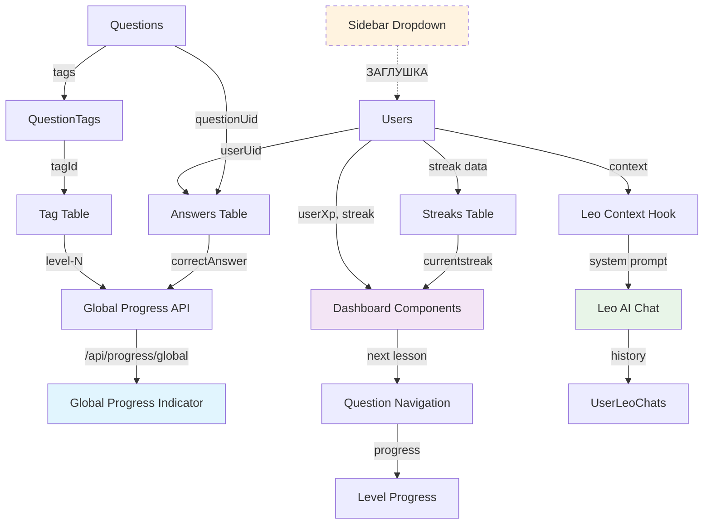

# Отчет: Анализ взаимосвязей систем прогресса BizLevel

## Обзор анализа

Проведен глубокий анализ трех основных систем прогресса в BizLevel:
1. **Глобальный индикатор прогресса** (GlobalProgressIndicator)
2. **Система прогресса в Sidebar** (sidebar-dropdown.tsx)
3. **Dashboard прогресс** (dashboard компоненты)

## 1. ГЛОБАЛЬНЫЙ ИНДИКАТОР ПРОГРЕССА

### Компоненты:
- **`src/components/app/navigation/global-progress-indicator.tsx`** - основной компонент
- **`src/app/api/progress/global/route.ts`** - API endpoint
- **`src/utils/data/progress/get-global-progress.ts`** - логика расчета

### Данные и логика:
```typescript
interface GlobalProgressData {
  completedLevels: number;
  totalLevels: number;
  overallProgress: number;
  currentLevelProgress?: number;
  userXp: number;
  weeklyXp: number;
  currentLevelName?: string;
  totalCompletedQuestions: number;
  totalQuestions: number;
}
```

### Как работает:
1. **Анализ по тегам**: Ищет теги с префиксом `level-` в таблице `Tag`
2. **Расчет прогресса**: 
   - Для каждого уровня находит вопросы через связь `QuestionTags`
   - Считает правильные ответы из таблицы `Answers` (correctAnswer = true)
   - Уровень считается завершенным при 80%+ правильных ответов
3. **Отображение**: Адаптивный UI (desktop/mobile версии)
4. **Интеграция**: Подключен в `providers.tsx` под header

### Используемые таблицы:
- ✅ `Tag` - для поиска уровневых тегов
- ✅ `Questions` - получение вопросов уровня
- ✅ `QuestionTags` - связь вопросов с тегами
- ✅ `Answers` - правильные ответы пользователя
- ✅ `Users` - данные пользователя (userXp, weeklyUserXp)

## 2. СИСТЕМА ПРОГРЕССА В SIDEBAR

### Компоненты:
- **`src/components/app/navigation/sidebar-dropdown.tsx`** - основной dropdown
- **`src/components/app/navigation/level-progress.tsx`** - детальный прогресс уровня
- **`src/components/app/navigation/question-navigation.tsx`** - навигация с прогрессом

### Функциональность Sidebar:
```typescript
// Заглушка в sidebar-dropdown.tsx (строка 29)
function getUserLearningProgress(user: UserRecord | null) {
  if (!user) return { completedLevels: 0, totalLevels: 5, overallProgress: 0 };
  
  // Временная заглушка - в будущем получать из БД
  return {
    completedLevels: 1,
    totalLevels: 5,
    overallProgress: 20,
  };
}
```

### Детальный прогресс уровня (LevelProgress):
- Показывает видео/тесты прогресс
- Анимации и конфетти при завершении
- Примерное время выполнения
- Интегрируется в question-navigation

### Используемые таблицы:
- ⚠️ **ЗАГЛУШКА** - не использует реальные данные БД
- 🔄 **TODO** - интеграция с реальной системой прогресса

## 3. DASHBOARD ПРОГРЕСС

### Компоненты:
- **`src/components/app/dashboard/dashboard-header.tsx`** - CurrentStreak, UserXp
- **`src/components/app/dashboard/next-question-bento-box.tsx`** - следующий урок
- **`src/components/app/dashboard/progression-bento-box.tsx`** - общий прогресс
- **`src/components/app/dashboard/welcome-bento-box.tsx`** - приветствие
- **`src/components/ui/current-streak.tsx`** - streak компонент
- **`src/components/ui/user-xp.tsx`** - XP компонент

### Показатели Dashboard:
1. **CurrentStreak** - ежедневная серия
2. **UserXp** - очки опыта пользователя
3. **Progress в bento-box** - прогресс следующего урока
4. **Level navigation** - навигация по урокам

### Используемые таблицы:
- ✅ `Users` - userXp, weeklyUserXp, correctDailyStreak, totalDailyStreak
- ✅ `Streaks` - currentstreakCount, longestStreak, streakStart/End
- ✅ `Answers` - для расчета прогресса уроков
- ✅ `Questions` + `QuestionTags` - для навигации

## 4. ИНТЕГРАЦИЯ С LEO AI

### Как Leo получает информацию о прогрессе:

#### 4.1 Контекст прогресса:
- **`src/hooks/use-leo-context.ts`** - определяет контекст страницы
- **Системный промпт** включает информацию о текущем местоположении пользователя

```typescript
// Пример контекста для Leo
if (pathname.startsWith('/question/')) {
  context = `Пользователь изучает урок: ${questionSlug}. Это может быть видео-урок или тест по бизнесу.`;
} else if (pathname === '/dashboard') {
  context = 'Пользователь на главной странице (dashboard). Он видит свой общий прогресс обучения.';
}
```

#### 4.2 Проактивные сообщения:
- **Неправильные ответы** - через `answer-hints.tsx`
- **Завершение уровня** - через `question-navigation.tsx`
- **Бездействие** - таймер в `leo-chat.tsx`

#### 4.3 Интеграция данных:
- Leo НЕ имеет прямого доступа к БД прогресса
- Контекст передается через URL параметры
- Сохранение в таблице `UserLeoChats`

## 5. ТАБЛИЦЫ SUPABASE ДЛЯ ПРОГРЕССА

### ⭐ Ключевые таблицы системы прогресса:

#### **Users** - основные метрики пользователя:
```sql
userXp: Int @default(0)                    -- Общие очки опыта
weeklyUserXp: Int @default(0)              -- Недельные очки
correctDailyStreak: Int @default(0)        -- Текущая серия
totalDailyStreak: Int @default(0)          -- Общая серия
```

#### **Answers** - ответы на вопросы:
```sql
correctAnswer: Boolean @default(false)     -- Правильность ответа
timeTaken: Int?                           -- Время выполнения
questionUid: String                       -- Связь с вопросом
userUid: String                          -- Связь с пользователем
```

#### **Streaks** - детальная информация о сериях:
```sql
currentstreakCount: Int @default(0)       -- Текущая серия
longestStreak: Int @default(0)           -- Самая длинная серия
streakStart: DateTime?                   -- Начало серии
streakEnd: DateTime?                     -- Конец серии
```

#### **Questions + QuestionTags + Tag** - система уровней:
```sql
Tag.name: String                         -- "level-1", "level-2", etc.
QuestionTags                            -- Связь многие-ко-многим
Questions.questionType                  -- VIDEO, MULTIPLE_CHOICE
```

### 📊 Вспомогательные таблицы:
- **StudyPath + UserStudyPath** - курсы и прогресс по ним
- **StatisticsReport** - отчеты по статистике
- **UserLeoChats** - история чатов с Leo
- **UserBookmarks** - закладки пользователя

## 6. СХЕМА ВЗАИМОСВЯЗЕЙ



## 7. ДУБЛИРОВАНИЕ И ПРОБЛЕМЫ

### 🔄 Дублирование логики:
1. **Расчет прогресса**:
   - GlobalProgressIndicator - реальные данные из БД
   - Sidebar dropdown - заглушка (TODO)
   - Dashboard bento-box - собственный расчет

2. **Источники данных**:
   - Разные компоненты запрашивают похожие данные отдельно
   - Нет единого store/context для прогресса

### ⚠️ Проблемы архитектуры:
1. **Sidebar заглушка** - не использует реальные данные
2. **Нет централизации** - каждый компонент сам запрашивает данные
3. **Leo контекст ограничен** - только URL-based, нет данных прогресса

## 8. API ENDPOINTS

### Существующие:
- ✅ **`/api/progress/global`** - глобальный прогресс (get-global-progress.ts)
- ✅ **`/api/cron/sync-user-streak`** - синхронизация streak
- ✅ **`/api/cron/set-daily-missions`** - ежедневные миссии

### Отсутствующие (нужны):
- ❌ `/api/progress/level/[level]` - прогресс конкретного уровня
- ❌ `/api/progress/user/summary` - сводка прогресса для sidebar
- ❌ `/api/progress/streak` - детальная информация о streak

## 9. РЕКОМЕНДАЦИИ

### Немедленные исправления:
1. **Убрать заглушку** в sidebar-dropdown.tsx - интегрировать с реальными данными
2. **Централизовать запросы** - создать единый хук use-user-progress
3. **Добавить Leo контекст** - передавать данные прогресса в Leo

### Долгосрочные улучшения:
1. **Создать Progress Context** - единое состояние прогресса
2. **Кэширование данных** - избежать дублирующих запросов
3. **Real-time updates** - обновление прогресса в реальном времени

## 10. ЗАКЛЮЧЕНИЕ

Система прогресса BizLevel состоит из **трех частично независимых** подсистем:

- **Глобальный индикатор** - ✅ полностью функционален, использует реальные данные БД
- **Sidebar прогресс** - ⚠️ заглушка, требует интеграции
- **Dashboard прогресс** - ✅ работает, но использует отдельную логику

**Leo AI** получает только контекстную информацию о местоположении пользователя, но не имеет доступа к детальным данным прогресса.

**Основные таблицы**: Users, Answers, Questions, QuestionTags, Tag, Streaks - все необходимые данные присутствуют в БД.

**Приоритет**: Интеграция sidebar с реальными данными и централизация логики прогресса. 