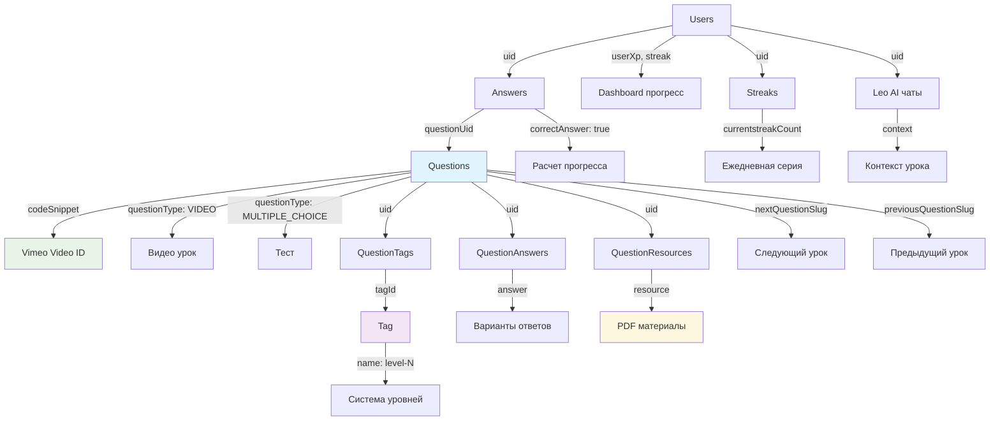

# Отчет: Аудит таблиц Supabase и системы уровней BizLevel

## Обзор анализа

Проведен полный аудит базы данных Supabase, анализ системы уровней, хранения Vimeo данных, ресурсов и навигации между вопросами.

## 1. ПОЛНЫЙ СПИСОК ВСЕХ ТАБЛИЦ SUPABASE

### ⭐ Основные таблицы системы уровней:

#### **Questions** - центральная таблица вопросов
```sql
uid: String @id @default(uuid())           -- Уникальный ID
question: String                           -- Текст вопроса
questionType: QuestionType @default(MULTIPLE_CHOICE) -- VIDEO, MULTIPLE_CHOICE, CODING_CHALLENGE
codeSnippet: String?                       -- Vimeo ID для VIDEO типа
title: String?                             -- Заголовок урока
difficulty: QuestionDifficulty @default(EASY) -- EASY, MEDIUM, HARD, BEGINNER
slug: String? @unique                      -- URL slug для навигации
slugGenerated: Boolean @default(false)    -- Флаг автогенерации slug
nextQuestionSlug: String?                  -- Следующий урок в цепочке
previousQuestionSlug: String?              -- Предыдущий урок в цепочке
isPremiumQuestion: Boolean @default(false) -- Платный контент
hint: String?                             -- Подсказка к уроку
correctAnswer: String                     -- Правильный ответ / "video_completed"
```

#### **Tag** - система тегов уровней
```sql
uid: String @id @default(uuid())
name: String @unique                      -- "level-1", "level-2", "business-basics", etc.
```

#### **QuestionTags** - связь вопросов с тегами (many-to-many)
```sql
questionId: String
tagId: String
-- Связывает Questions с Tag
```

#### **QuestionAnswers** - варианты ответов для MULTIPLE_CHOICE
```sql
uid: String @id @default(cuid())
answer: String                            -- Текст варианта ответа
questionUid: String                       -- Связь с Questions
isCodeSnippet: Boolean @default(false)    -- Флаг кода в ответе
answerFullSnippet: String?                -- Полный код (не используется в бизнесе)
answerType: QuestionAnswerType @default(STANDARD) -- PREFILL, STANDARD
```

#### **QuestionResources** - материалы к урокам
```sql
uid: String @id @default(cuid())
questionUid: String                       -- Связь с Questions
resource: String                          -- URL ресурса (PDF, ссылки)
title: String                            -- Название ресурса
```

#### **Answers** - ответы пользователей
```sql
uid: String @id @default(cuid())
userUid: String                          -- Связь с Users
questionUid: String                      -- Связь с Questions
correctAnswer: Boolean @default(false)   -- Правильность ответа
timeTaken: Int?                         -- Время выполнения (мс)
difficulty: AnswerDifficulty @default(EASY) -- Сложность ответа
questionDate: String @default("")        -- Дата вопроса
```

### 🔧 Таблицы пользователей и прогресса:

#### **Users** - основные данные пользователей
```sql
uid: String @id @default(uuid())
userXp: Int @default(0)                  -- Очки опыта
weeklyUserXp: Int @default(0)            -- Недельные очки
correctDailyStreak: Int @default(0)      -- Текущая серия дней
totalDailyStreak: Int @default(0)        -- Общая серия
userLevel: UserLevel @default(FREE)      -- FREE, PREMIUM
experienceLevel: ExperienceLevel @default(BEGINNER) -- Уровень опыта в бизнесе
```

#### **Streaks** - детальная информация о сериях
```sql
uid: String @id @default(uuid())
userUid: String                          -- Связь с Users
currentstreakCount: Int @default(0)      -- Текущая серия
longestStreak: Int @default(0)           -- Самая длинная серия
streakStart: DateTime?                   -- Начало серии
streakEnd: DateTime?                     -- Конец серии
```

#### **UserBookmarks** - закладки пользователей
```sql
uid: String @id @default(uuid())
userUid: String                          -- Связь с Users
questionUid: String                      -- Связь с Questions
```

### 📊 Система курсов и путей обучения:

#### **StudyPath** - курсы обучения
```sql
uid: String @id @default(uuid())
name: String                             -- Название курса
description: String?                     -- Описание
category: String?                        -- Категория (бизнес)
slug: String @unique                     -- URL slug
isPremium: Boolean @default(false)       -- Платный курс
estimatedTime: Int?                      -- Время прохождения
```

#### **UserStudyPath** - прогресс пользователей по курсам
```sql
uid: String @id @default(uuid())
userUid: String                          -- Связь с Users
studyPathUid: String                     -- Связь с StudyPath
completedQuestions: Int @default(0)      -- Завершенные уроки
totalQuestions: Int @default(0)          -- Всего уроков
isCompleted: Boolean @default(false)     -- Завершен ли курс
```

### 🤖 Система Leo AI:

#### **UserLeoChats** - история чатов с Leo
```sql
uid: String @id @default(uuid())
userUid: String                          -- Связь с Users
message: String                          -- Сообщение пользователя
response: String                         -- Ответ Leo
context: String?                         -- Контекст (URL, урок)
```

#### **AIPrompts** - системные промпты Leo
```sql
uid: String @id @default(uuid())
name: String @unique                     -- Название промпта
prompt: String                           -- Текст промпта
isActive: Boolean @default(true)         -- Активен ли
```

### 📈 Аналитика и отчеты:

#### **StatisticsReport** - отчеты статистики
```sql
uid: String @id @default(uuid())
userUid: String                          -- Связь с Users
questionsCompleted: Int                  -- Завершенные уроки
correctAnswers: Int                      -- Правильные ответы
totalTimeTaken: Int @default(0)          -- Общее время
```

### 🎮 Дополнительные системы:

#### **Subscriptions** - подписки пользователей
#### **Profile** - расширенные профили
#### **Leagues** - система лиг и соревнований
#### **Mission** - система миссий/достижений
#### **UserRoadmaps** - персональные roadmaps

## 2. СИСТЕМА ХРАНЕНИЯ VIMEO ДАННЫХ

### Как хранятся видео в БД:
```sql
Questions.codeSnippet: String?  -- Vimeo ID (например: "76979871")
Questions.questionType: VIDEO   -- Тип вопроса
```

### Примеры из seed данных:
```typescript
// Урок 1: Бизнес-модели
{
  uid: 'business-model-intro',
  type: 'VIDEO',
  videoId: '76979871', // → codeSnippet в БД
  title: 'Урок 1: Что такое бизнес-модель?'
}

// Урок 2: SMART-цели
{
  uid: 'smart-goals-video',
  type: 'VIDEO', 
  videoId: '148751763', // → codeSnippet в БД
  title: 'Урок 2: SMART-цели для предпринимателей'
}
```

### Компонент для воспроизведения:
- **`VerticalVideoPlayer.tsx`** - основной плеер
- **Настройки**: playsinline: true, responsive: true, controls: true
- **Размеры**: 
  - Mobile: window.innerWidth × (16/9)
  - Desktop: 320px × 568px
  - Fullscreen: window dimensions
- **Функции**: swipe navigation, localStorage прогресс, lazy loading

### Интеграция с системой прогресса:
```typescript
// При завершении видео
vimeoPlayer.on('ended', () => {
  localStorage.setItem(`videoProgress-${videoId}`, 'completed');
  onComplete?.();
});

// При начале просмотра
vimeoPlayer.on('play', () => {
  localStorage.setItem(`videoProgress-${videoId}`, 'started');
  onPlay?.();
});
```

## 3. СИСТЕМА РЕСУРСОВ И АРТЕФАКТОВ

### Структура ресурсов:
```sql
QuestionResources {
  questionUid: String  -- Связь с Questions
  resource: String     -- URL ресурса
  title: String        -- Название ресурса
}
```

### Примеры ресурсов из seed:
```typescript
// PDF материалы
{
  title: 'Гид по бизнес-моделям для начинающих',
  url: 'https://bizlevel.kz/resources/business-models-guide.pdf'
},
{
  title: 'Шаблон для постановки SMART-целей', 
  url: 'https://bizlevel.kz/resources/smart-goals-template.pdf'
},
{
  title: 'Чек-лист для исследования аудитории',
  url: 'https://bizlevel.kz/resources/audience-research-checklist.pdf'
}
```

### Использование в компонентах:
```typescript
// В Question type
QuestionResources?: QuestionResources[]; // Массив ресурсов

// В get.ts
QuestionResources: true, // Включить ресурсы в запрос
```

### Отображение ресурсов:
- Показываются на последнем уроке каждого уровня
- Функция `shouldShowLessonMaterials()` в business-lesson-helpers.ts
- Проверка через `isLastLessonInLevel()`

## 4. НАВИГАЦИЯ МЕЖДУ ВОПРОСАМИ

### Два способа навигации:

#### A) **Через хранимые ссылки** (nextQuestionSlug/previousQuestionSlug):
```sql
Questions.nextQuestionSlug: String?     -- Slug следующего урока
Questions.previousQuestionSlug: String? -- Slug предыдущего урока
```

#### B) **Через теги уровней** (getLevelBasedNavigation):
```typescript
// Алгоритм:
1. Найти теги уровня (level-1, level-2, etc.)
2. Получить все вопросы этого уровня
3. Отсортировать по createdAt
4. Найти текущий индекс
5. Вернуть prev/next по индексу
```

### Логика последовательности уроков:
```typescript
// Из getNextQuestionInSequence():
if (isVideo) {
  // После видео ищем тест в том же уровне
  for (let i = currentIndex + 1; i < questions.length; i++) {
    const isNextTest = nextQ.tags.some(t => t.tag.name.includes('test'));
    if (isNextTest) return nextQ;
  }
}
// Иначе - просто следующий урок
```

### Hook для навигации:
```typescript
// use-question-navigation.ts
const {
  nextQuestion,
  previousQuestion, 
  getNextQuestionUrl,
  getPreviousQuestionUrl
} = useQuestionNavigation();
```

### Прогресс по уровню:
```typescript
const progress = {
  current: currentIndex + 1,
  total: levelQuestions.length,
  level: levelTag, // "level-1"
  percentage: Math.round(((currentIndex + 1) / levelQuestions.length) * 100)
};
```

## 5. СХЕМА СВЯЗЕЙ КЛЮЧЕВЫХ ТАБЛИЦ



## 6. ИСПОЛЬЗОВАНИЕ ТАБЛИЦ В КОМПОНЕНТАХ

### Questions + QuestionTags + Tag:
- **GlobalProgressIndicator** - расчет прогресса по уровням
- **question-navigation.ts** - навигация между уроками  
- **LevelProgress** - отображение прогресса уровня
- **Dashboard** - следующий урок, статистика

### QuestionAnswers:
- **Страницы MULTIPLE_CHOICE** - варианты ответов
- **answer-hints.tsx** - подсказки Leo при неправильных ответах

### QuestionResources:  
- **business-lesson-helpers.ts** - материалы на последнем уроке
- **get.ts** - включение ресурсов в запросы

### Answers:
- **GlobalProgressIndicator** - подсчет правильных ответов
- **StatisticsReport** - отчеты прогресса
- **Dashboard** - общая статистика

### Users + Streaks:
- **CurrentStreak** component - ежедневная серия
- **UserXp** component - очки опыта
- **Dashboard** - общие метрики

### UserLeoChats + AIPrompts:
- **leo-chat.tsx** - история чатов
- **use-leo-context.ts** - определение контекста урока

## 7. КЛЮЧЕВЫЕ НАХОДКИ

### ✅ Что работает хорошо:
1. **Vimeo интеграция** полностью функциональна
2. **Система тегов уровней** позволяет гибко группировать уроки
3. **Навигация** поддерживает как ручные ссылки, так и автогенерацию
4. **Ресурсы** правильно привязаны к урокам

### ⚠️ Потенциальные улучшения:
1. **Дублирование навигации** - два способа могут конфликтовать
2. **Отсутствие промежуточного кеша** для часто используемых данных
3. **Leo AI контекст** ограничен URL-данными без прогресса
4. **Ресурсы показываются** только на последнем уроке уровня

### 🔧 Технический долг:
1. **CODING_CHALLENGE** тип остался в enum (наследие TechBlitz)
2. **codeSnippet** поле используется для Vimeo ID (переименовать в videoId)
3. **Некоторые поля** не используются в бизнес-контексте
4. **Миграции** содержат legacy данные

## Заключение

Система таблиц Supabase хорошо адаптирована для BizLevel. Основная структура поддерживает видео-уроки, тесты, ресурсы и прогресс. Архитектура гибкая и позволяет легко добавлять новые уровни и типы контента. 