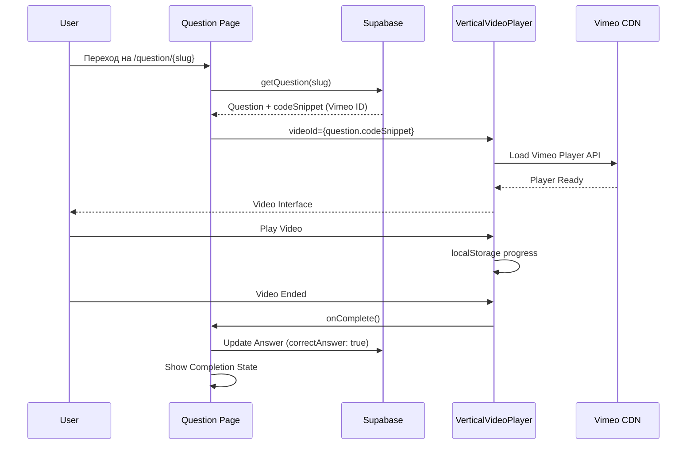
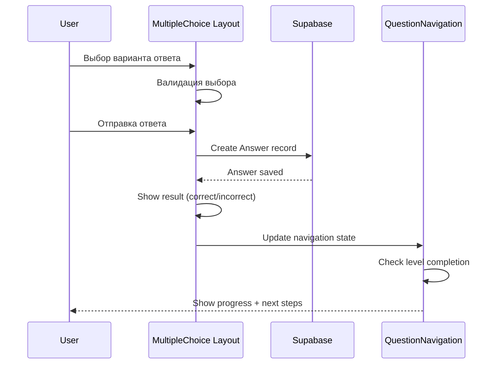
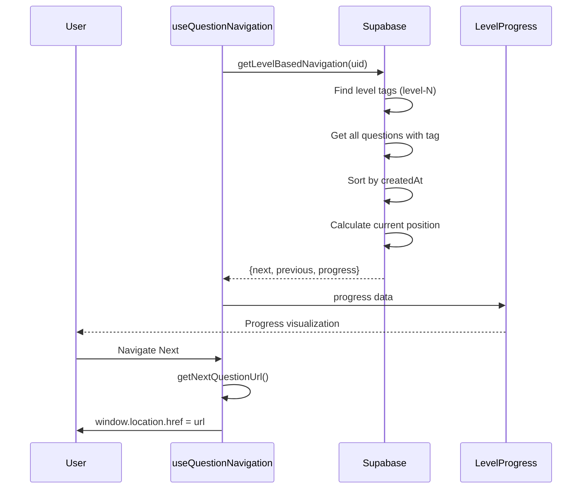

# Отчет: Анализ архитектуры компонентов уровней BizLevel

## Обзор анализа

Проведен архитектурный анализ компонентов отвечающих за систему уровней, включая иерархию, маршруты, типы вопросов, навигацию, hooks и utilities.

## 1. ИЕРАРХИЯ КОМПОНЕНТОВ ОТ ROADMAPS ДО ОТДЕЛЬНОГО ВОПРОСА

### Структура маршрутов:
```
/roadmaps (карта уровней)
    ↓
/roadmaps/{slug} (отдельный курс)
    ↓
/question/{slug} (конкретный урок)
```

### Архитектура компонентов:

```mermaid
graph TB
    RoadmapsPage["/roadmaps page.tsx"] --> Hero[Hero Component]
    RoadmapsPage --> StudyPathCards["StudyPathCard[]"]
    
    StudyPathCards --> StudyPathCard[StudyPathCard.tsx]
    StudyPathCard --> CourseProgress[Progress Bar]
    StudyPathCard --> EnrollmentButton["Start/Continue Button"]
    
    StudyPathCard --> |href: /roadmaps/{slug}| CourseDetailPage[Course Detail Page]
    CourseDetailPage --> |href: /question/{slug}| QuestionPage[Question Page]
    
    QuestionPage --> QuestionLayout[Question Layout]
    QuestionLayout --> QuestionCard[QuestionCard.tsx]
    QuestionLayout --> QuestionNavigation[QuestionNavigation.tsx]
    
    QuestionCard --> VideoPlayer[VIDEO Type]
    QuestionCard --> MultipleChoice[MULTIPLE_CHOICE Type]
    QuestionCard --> CodingChallenge[CODING_CHALLENGE Type]
    
    VideoPlayer --> VerticalVideoPlayer[VerticalVideoPlayer.tsx]
    MultipleChoice --> MultipleChoiceLayout[MultipleChoiceLayout.tsx]
    CodingChallenge --> CodeEditor[Monaco Editor]
    
    QuestionNavigation --> LevelProgress[LevelProgress.tsx]
    QuestionNavigation --> ContinueJourney[ContinueJourney.tsx]
    
    style VideoPlayer fill:#e8f5e8
    style MultipleChoice fill:#e1f5fe
    style CodingChallenge fill:#fff3e0,stroke-dasharray: 5 5
```

## 2. МАРШРУТЫ И ИХ ВЗАИМОСВЯЗИ

### Основные маршруты:

#### A) **Карта уровней**: `/roadmaps`
```typescript
// src/app/(app)/(default_layout)/(roadmaps)/roadmaps/page.tsx
- Показывает все доступные курсы (StudyPath)
- Группировка по категориям
- Отображение прогресса пользователя
- ContinueJourney кнопка для продолжения обучения
```

#### B) **Детализация курса**: `/roadmaps/{slug}`
```typescript
// src/app/(app)/(default_layout)/(roadmaps)/roadmaps/[slug]/page.tsx
- Список уроков курса
- Отображение заблокированных/доступных уроков
- Навигация к конкретным урокам
```

#### C) **Страница урока**: `/question/{slug}`
```typescript
// src/app/(questions)/question/[slug]/page.tsx
- Основной контент урока
- Поддержка VIDEO, MULTIPLE_CHOICE, CODING_CHALLENGE типов
- Навигация между уроками
- Интеграция с Leo AI
```

### Навигационные связи:
```typescript
// Логика навигации в useQuestionNavigation
question/lesson-1 → question/lesson-2 → question/lesson-3
        ↑                    ↑                    ↑
   previousQuestion    currentQuestion      nextQuestion
```

## 3. КОМПОНЕНТЫ ДЛЯ РАЗНЫХ ТИПОВ ВОПРОСОВ

### VIDEO тип (Видео-уроки):

#### **Основной компонент**: `VerticalVideoPlayer.tsx`
```typescript
// Особенности:
- Lazy loading Vimeo Player (@vimeo/player)
- Адаптивные размеры (mobile: 16:9, desktop: 320x568)
- playsinline: true для мобильных
- Swipe navigation support
- localStorage для сохранения прогресса
- onComplete callback для автоматического продвижения
```

#### **Интеграция в QuestionCard**:
```typescript
{question.questionType === 'VIDEO' ? (
  <div className="p-4 lg:p-0 h-full flex items-center justify-center">
    <VerticalVideoPlayer
      videoId={question.codeSnippet} // Vimeo ID хранится в codeSnippet
      title={question.title}
      enableSwipeNavigation={true}
      onComplete={() => setCurrentLayout('answer')}
    />
  </div>
)}
```

### MULTIPLE_CHOICE тип (Тесты):

#### **Основной компонент**: `MultipleChoiceLayout.tsx`
```typescript
// Структура:
- MultipleChoiceLayout (server) → MultipleChoiceLayoutClient
- Markdown поддержка для описания
- Центрированный UI
- Полноширинный layout без правого сайдбара
```

#### **Особенности компонента**:
```typescript
// src/components/app/questions/multiple-choice/layout.client.tsx
- Управление состоянием ответов
- Валидация выбранных вариантов  
- Интеграция с системой прогресса
- Анимации и обратная связь
```

### CODING_CHALLENGE тип (ЗАГЛУШКА):

#### **Статус**: Legacy от TechBlitz, используется как заглушка
```typescript
// В question/[slug]/page.tsx:
const isCodingChallenge = question?.questionType === 'CODING_CHALLENGE';

// Условная загрузка Monaco Editor
{isCodingChallenge ? <CodeEditor /> : <CodeDisplayWrapper />}
```

#### **Компоненты**: 
- Monaco Editor (disabled для бизнеса)
- TestCase Section (не используется)
- ResizableLayout (только для CODING_CHALLENGE)

## 4. СИСТЕМА НАВИГАЦИИ И ПРОГРЕССА

### Главный компонент: `QuestionNavigation.tsx`

#### **Функциональность**:
```typescript
- Отображение кнопок Previous/Next
- LevelProgress компонент
- Состояния завершения с анимациями
- Конфетти при завершении уровня
- Проактивные сообщения Leo AI
- Адаптивный UI для мобильных/десктопа
```

#### **Состояния завершения**:
```typescript
// Для VIDEO типа
if (question.questionType === 'VIDEO' && currentLayout === 'answer') {
  setShowCompletionState(true);
}

// Для MULTIPLE_CHOICE типа
if (question.questionType === 'MULTIPLE_CHOICE' && correctAnswer === 'correct') {
  setShowCompletionState(true);
}

// При завершении уровня
if (progress.current === progress.total) {
  setIsLevelCompleted(true);
  setShowConfetti(true);
  triggerLeoProactiveMessage({ type: 'level_completion' });
}
```

### Компонент прогресса: `LevelProgress.tsx`

#### **Отображаемая информация**:
```typescript
interface LevelProgressProps {
  progress: {
    current: number;        // Текущий урок
    total: number;          // Всего уроков
    level: string;          // "level-1"
    percentage: number;     // Процент завершения
    videosCompleted?: number;
    totalVideos?: number;
    testsCompleted?: number;
    totalTests?: number;
    estimatedTimeRemaining?: number; // минуты
  };
}
```

#### **UI элементы**:
- Анимированный прогресс-бар
- Детализация по типам (видео/тесты)
- Примерное время завершения
- Конфетти анимация при 100%
- Иконки и цветовая индикация

### Навигационная кнопка: `ContinueJourney.tsx`

#### **Логика определения действия**:
```typescript
const lastLessonData = await getLastLesson();
const buttonUrl = lastLessonData.nextLessonUrl || '/roadmaps';
const defaultText = lastLessonData.isNewUser 
  ? 'Начать обучение'
  : lastLessonData.nextLessonUrl 
    ? 'Продолжить обучение' 
    : 'Карта уровней';
```

## 5. HOOKS И UTILITIES ПОДДЕРЖИВАЮЩИЕ УРОВНИ

### Основной hook: `useQuestionNavigation.ts`

#### **Возможности**:
```typescript
interface UseQuestionNavigationReturn {
  // Navigation URLs
  nextQuestion: string | null;
  previousQuestion: string | null;
  
  // Progress tracking  
  progress: NavigationProgress | null;
  
  // Navigation state
  isLoading: boolean;
  canGoNext: boolean;
  canGoPrev: boolean;
  
  // Navigation actions
  navigateNext: () => void;
  navigatePrevious: () => void;
  
  // URL generation helpers
  getNextQuestionUrl: () => string | null;
  getPreviousQuestionUrl: () => string | null;
  
  // Text helpers for UI
  getNextActionText: (questionType?: string, isLevelCompleted?: boolean) => string;
}
```

#### **Поддерживаемые типы навигации**:
- `question` - обычные уроки по тегам уровней
- `roadmap` - кастомные roadmaps
- `study-path` - структурированные курсы

### Hook уведомлений: `useProgressNotifications.ts`

#### **Типы уведомлений**:
```typescript
- showLessonComplete(lessonName, lessonType) // Завершение урока
- showLevelComplete(levelName)               // Завершение уровня  
- showAchievement(achievementName, rarity)   // Новые достижения
- showWelcomeBack(daysAway)                  // Возвращение пользователя
- showStreakNotification(streakDays)         // Серии дней
```

#### **Особенности**:
- Debounce защита от спама
- localStorage персистентность
- Поддержка показа "только один раз"
- Интеграция с sonner toast системой

### Utility функции: `business-lesson-helpers.ts`

#### **Основные функции**:
```typescript
export function isLastLessonInLevel(question: Question): boolean;
export function getLevelTitle(question: Question): string | undefined;
export function shouldShowLessonMaterials(question: Question): boolean;
```

#### **Маппинг уровней**:
```typescript
const levelMap: Record<string, string> = {
  'level-1': 'Основы бизнеса',
  'level-2': 'Маркетинг', 
  'level-3': 'Продажи',
  'level-4': 'Управление',
  'level-5': 'Финансы'
};
```

## 6. ТОЧКИ ИНТЕГРАЦИИ С SUPABASE

### Основные интеграции:

#### **Получение данных урока**:
```typescript
// src/utils/data/questions/get.ts
const question = await getQuestion('slug', slug);
// Включает: QuestionResources, QuestionAnswers, Tags
```

#### **Навигация между уроками**:
```typescript
// src/utils/data/questions/question-navigation.ts
const nextPrev = await getLevelBasedNavigation(question.uid);
// Использует: Questions, QuestionTags, Tag таблицы
```

#### **Сохранение прогресса**:
```typescript
// src/hooks/use-save-progress.ts
// Обновляет: Answers, Users (userXp, streak) таблицы
```

#### **Глобальный прогресс**:
```typescript
// src/utils/data/progress/get-global-progress.ts  
// Анализирует: Tag (level-N), Questions, Answers таблицы
```

## 7. ПОТОКИ ДАННЫХ ОТ БД ДО UI

### Поток данных для VIDEO урока:



### Поток данных для MULTIPLE_CHOICE теста:



### Поток навигации по уровням:



## 8. КЛЮЧЕВЫЕ АРХИТЕКТУРНЫЕ РЕШЕНИЯ

### ✅ **Успешные решения**:

1. **Условная загрузка компонентов**:
   - Dynamic imports для тяжелых компонентов
   - Lazy loading Vimeo Player
   - Условное отображение UI элементов

2. **Единообразный hook навигации**:
   - Централизованная логика в `useQuestionNavigation`
   - Поддержка разных типов путей
   - Консистентный API для всех компонентов

3. **Адаптивный дизайн**:
   - Полноширинный layout для бизнес-уроков
   - Мобильно-оптимизированный VerticalVideoPlayer
   - Адаптивные размеры и контролы

4. **Прогрессивная система прогресса**:
   - Детализированный LevelProgress
   - Анимации и обратная связь
   - Проактивные уведомления

### ⚠️ **Области для улучшения**:

1. **Дублирование логики прогресса**:
   - Расчеты в нескольких местах
   - Отсутствие централизованного store

2. **Legacy код от TechBlitz**:
   - CODING_CHALLENGE компоненты не используются
   - Monaco Editor загружается без необходимости

3. **Ограниченная интеграция Leo AI**:
   - Только URL-based контекст
   - Нет доступа к детальному прогрессу

4. **Отсутствие offline поддержки**:
   - Нет кеширования видео
   - Зависимость от интернета для навигации

### 🔧 **Рекомендации по улучшению**:

1. **Централизация состояния прогресса**:
   - React Context или Zustand store
   - Единый источник правды для прогресса

2. **Очистка legacy кода**:
   - Удаление неиспользуемых CODING_CHALLENGE компонентов
   - Оптимизация bundle size

3. **Улучшение производительности**:
   - Виртуализация списков уроков
   - Предзагрузка следующего урока

4. **Расширение Leo AI интеграции**:
   - Передача прогресса в контекст
   - Персонализированные рекомендации

## Заключение

Архитектура компонентов уровней BizLevel демонстрирует хорошо продуманную иерархию от карты уровней до отдельных уроков. Система поддерживает три основных типа контента с адаптивным UI и централизованной навигацией. Основные сильные стороны - это гибкость, производительность и пользовательский опыт. Потенциал для улучшения лежит в централизации состояния и оптимизации legacy кода. 