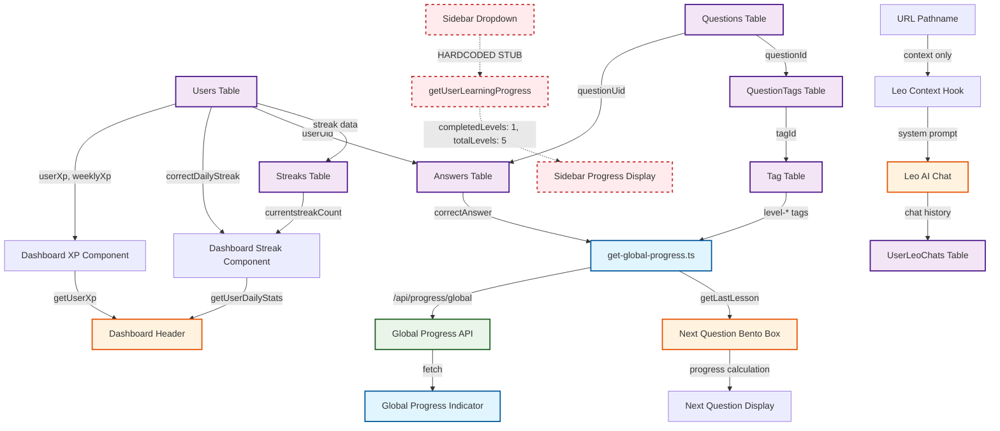

# Анализ систем прогресса BizLevel

## Исполнительное резюме

В проекте BizLevel обнаружены **3 основные системы прогресса**:

1. **Глобальный индикатор прогресса** - полнофункциональная система
2. **Sidebar прогресс** - содержит заглушку, требует интеграции
3. **Dashboard прогресс** - частично функциональная система с отдельной логикой

Каждая система использует собственные API вызовы и логику расчета, что создает дублирование и потенциальные несоответствия данных.

---

## Система 1: Глобальный индикатор прогресса

### Компоненты
- **Основной компонент**: `src/components/app/navigation/global-progress-indicator.tsx`
- **API endpoint**: `src/app/api/progress/global/route.ts`
- **Логика расчета**: `src/utils/data/progress/get-global-progress.ts`

### Статус: ✅ ПОЛНОСТЬЮ ФУНКЦИОНАЛЬНАЯ

### Источники данных
```typescript
interface GlobalProgressData {
  completedLevels: number;
  totalLevels: number;
  overallProgress: number;
  currentLevelProgress?: number;
  userXp: number;
  weeklyXp: number;
  currentLevelName?: string;
  totalCompletedQuestions: number;
  totalQuestions: number;
}
```

### Используемые таблицы БД
- ✅ `Tag` - поиск уровневых тегов (level-1, level-2, etc.)
- ✅ `Questions` - получение вопросов по уровням
- ✅ `QuestionTags` - связь вопросов с тегами уровней
- ✅ `Answers` - правильные ответы пользователя (correctAnswer = true)
- ✅ `Users` - данные пользователя (userXp, weeklyUserXp)

### Логика расчета
1. **Анализ по тегам**: Находит все теги с префиксом `level-`
2. **Расчет прогресса уровня**: 
   - Получает вопросы уровня через `QuestionTags`
   - Считает правильные ответы из `Answers`
   - Уровень завершен при 80%+ правильных ответов
3. **Общий прогресс**: Процент правильных ответов от всех вопросов

### Места отображения
- **Интеграция**: Подключен в `providers.tsx` под header
- **Адаптивность**: Отдельные версии для desktop/mobile
- **Анимации**: Использует framer-motion для плавности

---

## Система 2: Sidebar прогресс

### Компоненты
- **Основной компонент**: `src/components/app/navigation/sidebar-dropdown.tsx`
- **Детальный прогресс**: `src/components/app/navigation/level-progress.tsx`
- **Навигация**: `src/components/app/navigation/question-navigation.tsx`

### Статус: ⚠️ ЗАГЛУШКА - ТРЕБУЕТ ИНТЕГРАЦИИ

### Критическая проблема
**Строка 29-37 в sidebar-dropdown.tsx содержит хардкод:**
```typescript
// BIZLEVEL: Заглушка для общего прогресса обучения
// TODO: Интегрировать с реальными данными пользователя
function getUserLearningProgress(user: UserRecord | null) {
  if (!user) return { completedLevels: 0, totalLevels: 5, overallProgress: 0 };
  
  // Временная заглушка - в будущем получать из БД
  return {
    completedLevels: 1,     // Хардкод!
    totalLevels: 5,         // Хардкод!
    overallProgress: 20,    // Хардкод!
  };
}
```

### Используемые таблицы БД
- ❌ **НЕТ** - функция возвращает статичные данные
- 🔄 **ТРЕБУЕТСЯ**: Интеграция с реальными данными прогресса

### Места отображения
- **Sidebar dropdown**: Показывает общий прогресс с прогресс-баром
- **Компоненты**: Target иконка, Trophy для завершенных уровней
- **Адаптивность**: Скрывается при коллапсе sidebar

---

## Система 3: Dashboard прогресс

### Компоненты
- **Header**: `src/components/app/dashboard/dashboard-header.tsx`
- **Next Question**: `src/components/app/dashboard/next-question-bento-box.tsx`
- **Progression**: `src/components/app/dashboard/progression-bento-box.tsx`
- **UI компоненты**: `src/components/ui/current-streak.tsx`, `src/components/ui/user-xp.tsx`

### Статус: 🔄 ЧАСТИЧНО ФУНКЦИОНАЛЬНАЯ

### Источники данных
Dashboard использует отдельные функции для каждого показателя:
- **Current Streak**: `getUserDailyStats()` → таблица `Users.streak`
- **User XP**: `getUserXp()` → таблица `Users.userXp`
- **Next Lesson**: `getLastLesson()` → анализ прогресса по тегам

### Используемые таблицы БД
- ✅ `Users` - userXp, weeklyUserXp, correctDailyStreak, totalDailyStreak
- ✅ `Streaks` - currentstreakCount, longestStreak, streakStart, streakEnd
- ✅ `Answers` - для расчета прогресса уроков
- ✅ `Questions` + `QuestionTags` - для определения следующего урока

### Отображаемые метрики
1. **Current Streak** - иконка пламени + счетчик дней
2. **User XP** - иконка молнии + количество XP
3. **Next Question** - прогресс-бар текущего уровня
4. **Progression** - карточки с бизнес-темами

### Проблемы
- **Дублирование логики**: Отдельные расчеты для каждого компонента
- **Множественные API вызовы**: Каждый компонент делает свои запросы
- **Несогласованность**: Может показывать разные данные с GlobalProgress

---

## Интеграция с Leo AI

### Компоненты
- **Контекст**: `src/hooks/use-leo-context.ts`
- **Чат**: `src/components/app/leo/leo-chat.tsx`

### Текущее состояние
Leo AI **НЕ имеет доступа** к данным прогресса пользователя:
- ❌ Не знает текущий уровень пользователя
- ❌ Не знает количество завершенных уроков
- ❌ Не знает streak и XP
- ❌ Не знает проблемные темы

### Контекст передается только через URL
```typescript
if (pathname.startsWith('/question/')) {
  context = `Пользователь изучает урок: ${questionSlug}`;
} else if (pathname === '/dashboard') {
  context = 'Пользователь на главной странице (dashboard)';
}
```

### Ограничения
- **Статический контекст**: Основан только на URL
- **Нет персонализации**: Не учитывает индивидуальный прогресс
- **Упущенные возможности**: Не может давать персональные рекомендации

---

## Таблицы Supabase для прогресса

### Основные таблицы
```sql
-- Пользователи и их метрики
Users:
  userXp: Int @default(0)                    -- Общие очки опыта
  weeklyUserXp: Int @default(0)              -- Недельные очки
  correctDailyStreak: Int @default(0)        -- Текущая серия
  totalDailyStreak: Int @default(0)          -- Общая серия

-- Ответы на вопросы
Answers:
  correctAnswer: Boolean @default(false)     -- Правильность ответа
  timeTaken: Int?                           -- Время выполнения
  questionUid: String                       -- ID вопроса
  userUid: String                          -- ID пользователя

-- Детальная информация о сериях
Streaks:
  currentstreakCount: Int @default(0)       -- Текущая серия
  longestStreak: Int @default(0)           -- Самая длинная серия
  streakStart: DateTime?                   -- Начало серии
  streakEnd: DateTime?                     -- Конец серии

-- Система уровней
Tag:
  name: String                             -- "level-1", "level-2", etc.
  
Questions:
  questionType: QuestionType               -- VIDEO, MULTIPLE_CHOICE
  
QuestionTags:
  questionId: String                       -- Связь многие-ко-многим
  tagId: String
```

### Вспомогательные таблицы
- **StudyPath** + **UserStudyPath** - курсы и прогресс
- **UserLeoChats** - история чатов с Leo
- **UserBookmarks** - закладки пользователя

---

## API Endpoints

### Существующие
- ✅ `/api/progress/global` - глобальный прогресс (полнофункциональный)

### Отсутствующие
- ❌ `/api/progress/unified` - единый endpoint для всех данных
- ❌ `/api/progress/sidebar` - данные для sidebar
- ❌ `/api/progress/dashboard` - метрики dashboard
- ❌ `/api/progress/leo` - контекст для Leo AI

---

## Диаграмма взаимосвязей



---

## Проблемы дублирования

### 1. Множественные расчеты прогресса
- **GlobalProgress**: Анализирует теги и ответы
- **Dashboard**: Отдельные функции для streak/XP
- **Sidebar**: Заглушка с хардкодом

### 2. Несогласованные данные
- **Разные источники**: Каждая система может показывать разные цифры
- **Кэширование**: Нет единого кэша для прогресса
- **Обновления**: Изменения могут не синхронизироваться

### 3. Производительность
- **Множественные запросы**: Каждый компонент делает свои запросы к БД
- **Дублирование логики**: Одинаковые расчеты в разных местах
- **Нет оптимизации**: Отсутствует батчинг запросов

---

## Рекомендации для унификации

### 1. Создать единый API endpoint
- **`/api/progress/unified`** - возвращает все данные прогресса
- **Кэширование**: 5-минутный кэш для оптимизации
- **Типизация**: Единый интерфейс для всех компонентов

### 2. Единый хук useUnifiedProgress
- **SWR**: Кэширование на клиенте
- **Селекторы**: Удобные геттеры для компонентов
- **Автообновление**: Периодическая синхронизация

### 3. Интеграция с Leo AI
- **Контекст прогресса**: Передача данных о текущем уровне
- **Персонализация**: Рекомендации на основе прогресса
- **Проактивность**: Уведомления о достижениях

### 4. Удаление заглушек
- **Sidebar**: Замена хардкода на реальные данные
- **Консистентность**: Единые источники данных
- **Тестирование**: Проверка корректности отображения

---

## Заключение

Анализ выявил **критическую необходимость унификации** систем прогресса. Текущее состояние:

- ✅ **1 система полностью функциональна** (GlobalProgressIndicator)
- ⚠️ **1 система является заглушкой** (Sidebar)
- 🔄 **1 система частично функциональна** (Dashboard)
- ❌ **Leo AI не интегрирован** с данными прогресса

**Следующие шаги**: Задачи 8.1.2-8.1.5 должны создать единую систему прогресса, которая устранит дублирование и обеспечит консистентность данных во всем приложении.