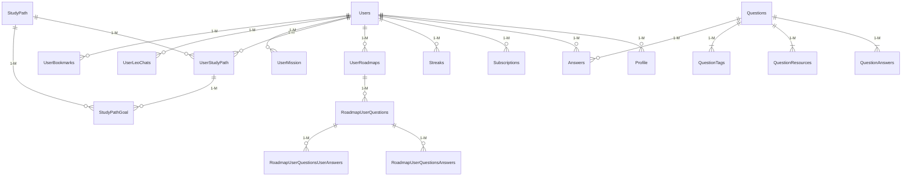

# Отчёт по базе данных Supabase (состояние после Fix-8)

Ниже приведён консолидированный обзор всех **актуальных** таблиц в публичной схеме Supabase-проекта `sccuzcjodwipzcjiixau` (репозиторий BizLevel).

> В скобках указано приблизительное количество строк по оценке Postgres (`live_rows_estimate`).

## 1. Пользователи и профили

### Users (≈2)
Назначение: хранит базовую учётную запись пользователя BizLevel.

Ключевые столбцы:
- `uid` — первичный ключ, одинаков с `auth.users.id`.
- `email`, `userLevel`, `experienceLevel` — бизнес-роли (FREE / PREMIUM и т. д.).
- Метрики вовлечения: `userXp`, `weeklyUserXp`, `correctDailyStreak`, `totalDailyStreak`.
- Настройки: `sendPushNotifications`, `sendPromotionalEmails`, `codeEditorTheme`.

Связи:
- 1-M с `Profile`, `Subscriptions`, `Answers`, `Streaks`, `UserRoadmaps`, `UserStudyPath`, `UserMission`, `UserLeoChats`, `UserBookmarks`, `StudyPathGoal`.

Используется компонентами: контекст аутентификации (`src/contexts/user-context.tsx`), страницы профиля, расчёт прогресса `/api/progress/unified`.

### Profile (≈2)
Расширенный публичный профиль: соцсети, биография, публичность.

Связь: FK → `Users.uid`.

Компоненты: `profile/page.tsx`, карточки автора в блоге.

## 2. Контент обучения

### Questions (7)
Хранит **уроки** (VIDEO, MULTIPLE_CHOICE, CODING_CHALLENGE).

Ключи:
- `questionType`, `difficulty`, `slug`, `videoUrl`, `nextQuestionSlug`, `previousQuestionSlug`.

Связи:
- 1-M `QuestionAnswers`, `Answers`, `QuestionResources`, `QuestionTags`, `UserBookmarks`.

Отображается: `question-card.tsx`, страница `/question/[slug]`.

### QuestionAnswers (18)
Справочник вариантов ответов для MULTIPLE_CHOICE вопросов.

Ключевые поля: `answer`, `isCodeSnippet`, `answerType`.

### QuestionResources (3)
Доп. материалы: PDF, ссылки.

### Tag (5) + QuestionTags (20)
Теги уровня (`level-1`, `level-2` …) и связь Many-to-Many с `Questions`.
Компонент: `use-level-tags.ts`, фильтры вопросов.

## 3. Ответы пользователей

### Answers (3)
Факт ответа на обычный урок (не roadmap). Хранит `correctAnswer`, `timeTaken`, `difficulty`.

### UserBookmarks (0)
Закладки пользователя на вопросы или roadmap-вопросы.

## 4. Системы Roadmap (AI-генератор)

### UserRoadmaps (0)
Корневая запись сгенерированного roadmap (статус, progress).

### RoadmapUserQuestions (0)
Копия вопроса внутри roadmap + поле `userCorrect`.

### RoadmapUserQuestionsAnswers / RoadmapUserQuestionsUserAnswers (0)
Ответы-варианты и ответы пользователя внутри roadmap.

### DefaultRoadmapQuestions / DefaultRoadmapQuestionsAnswers (0)
Шаблоны, из которых AI собирает персональный roadmap.

## 5. Study Path (Карта уровней)

### StudyPath (12)
Описание фиксированного «уровня»/темы (slug, title, category, overviewData).

### UserStudyPath (0)
Привязка пользователя к уровню + прогресс %.

### StudyPathGoal (0)
Цели («пройти до даты»), связаны с `UserStudyPath`.

## 6. Прогресс и геймификация

### Streaks (1)
Хранит текущую и максимальную серию дней с правильными ответами.

### Subscriptions (1)
Платные планы Stripe. Хранит `productId`, `stripeSubscriptionId`, флаги trial.

### Mission (0) & UserMission (0)
Система миссий (ответить N вопросов, пригласить друга …). Статус, прогресс.

## 7. Дополнительные сервисы

### UserLeoChats (0)
История общения с AI-наставником Leo. RLS включён (только свои записи).

### PseoPages (0)
Динамические SEO-страницы маркетинга.

## 8. Внутренние служебные таблицы

- `_prisma_migrations` — лог Prisma миграций, **не трогать**.

## Связи на диаграмме

## Рекомендации по чистке

1. **Проверить Roadmap таблицы** — если roadmap-функция не планируется к MVP, можно оставить только `DefaultRoadmapQuestions` и архивировать остальные.
2. **PseoPages**: используется только маркетингом, убедиться в актуальности полей или перенести в отдельный micro-CMS.
3. **Mission / UserMission**: активировать миссии или удалить, но сохранить FK целостность.
4. **Code-специфичные поля** в `Questions` (functionName, returnType, codeSnippet, isCodeSnippet) — оставить только если требуются для будущих бизнес-квизов.
5. Таблицы с нулевой статистикой строк можно пометить как deprecated и скрыть из API до окончательного решения.

> Любое удаление следует начинать с RLS/триггеров OFF, затем архивировать данные (`_archive` схемой) и только потом дропать.

---

Документ подготовлен автоматически на основе структурного анализа Supabase и исходного кода BizLevel.
