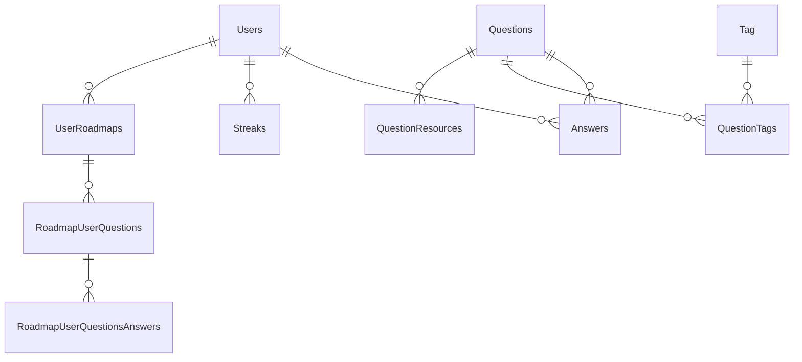

# Структура базы данных BizLevel

_Актуально на 2025-07-03_

> В основе BizLevel минималистичная схема из **13 основных таблиц**. Удалены Roadmap-* и другие технические сущности TechBlitz, добавлены поля для бизнес-контента (VIDEO уроки, Vimeo ID и т.д.).

| Таблица | Назначение | Ключевые связи |
|---------|------------|----------------|
| **Users** | Учётные записи, подписки, streak и т.д. | Answers, Streaks, UserRoadmaps |
| **Questions** | Все уроки (VIDEO, MULTIPLE_CHOICE, CODING_CHALLENGE*) | QuestionTags, Answers, QuestionResources |
| **Answers** | Ответы пользователей на вопросы | Users (userUid), Questions (questionUid) |
| **Tag** | Теги уровней `level-X` и тематические | QuestionTags |
| **QuestionTags** | M-to-M: Questions ↔︎ Tag | composite FK (questionId, tagId) |
| **QuestionResources** | PDF/ссылки для уроков | Questions (questionUid) |
| **Streaks** | Ежедневные серии ответов | Users |
| **UserRoadmaps** | Персональные roadmaps (оставлено для совместимости) | RoadmapUserQuestions |
| **RoadmapUserQuestions** | Вопросы внутри roadmap'a | UserRoadmaps, Questions |
| **RoadmapUserQuestionsAnswers** | Ответы на roadmap-вопросы | RoadmapUserQuestions |
| **StatisticsReport** | Отчёты статистики (dashboard) | Users, Questions |
| **Subscriptions** | Stripe подписки | Users |
| **Waitlist** | Маркетинг ожидания | — |

\*Тип `CODING_CHALLENGE` сохранён в enum, но в бизнес-контенте не используется.

## Вью `user_level_progress`
Задача 8.3.5 добавила агрегирующее представление, упрощающее расчёт прогресса:
```
user_id | level_tag | total_questions | completed_questions | progress_percent
```
Используется API `/api/progress/unified`.

## Ключевые индексы
* `idx_answers_user_question` – выборка ответов пользователя
* `idx_question_tags_tag` – фильтрация вопросов по тегу
* `idx_questions_slug` – быстрый `slug`-routing
* `idx_tags_name_level_pattern` – частичный индекс тэгов уровня

## Диаграмма (Mermaid)


---
> Если вы добавляете новую таблицу, **обновите этот документ** и создайте соответствующие индексы. 